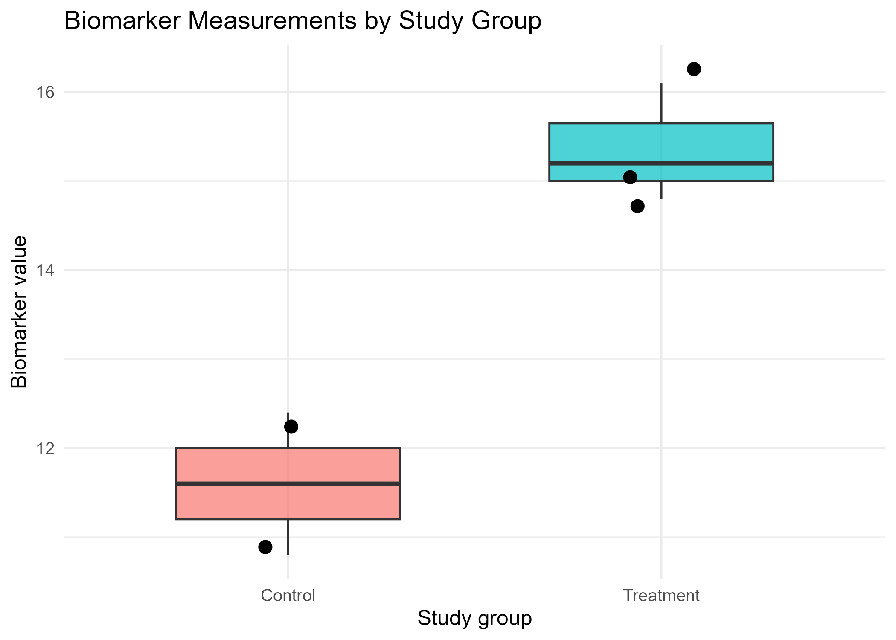

# Biomedical Data Quality-Control Case Study Using R and Bash 
 
## Project objective 
 
This educational project demonstrates a simple, reproducible biomedical data quality-control workflow using Bash and R. 
 
The analysis checks a small example patient-measurement dataset for duplicate patient identifiers and missing values, creates a cleaned dataset, produces descriptive summaries and visualisations, and performs an exploratory statistical comparison. 


 
## Dataset 
 
The project uses a small simulated biomedical dataset containing: 
 
- Patient identifier 
- Study group: Control or Treatment 
- Age 
- Biomarker measurement 
 
The raw dataset intentionally includes data-quality issues for demonstration: 
 
- One duplicated patient identifier (`P006`) 
- One missing age value (`P005`) 
 
This is a simulated educational dataset and does not contain real patient data. 
 
## Quality-control workflow 
 
1. Used a Bash script to check whether the input file exists. 
2. Counted data rows. 
3. Identified duplicate patient IDs. 
4. Identified rows containing missing values. 
5. Loaded the dataset into R. 
6. Created a missing-value summary. 
7. Identified duplicate patient records. 
8. Retained the first occurrence of each patient ID. 
9. Removed the record with missing age. 
10. Saved a cleaned dataset and summary outputs. 
 
## Results 
 
- Raw data rows: 7 
- Duplicate patient ID detected: `P006` 
- Missing age value detected for: `P005` 
- Rows after removing duplicate IDs: 6 
- Rows after removing the missing-age record: 5 
 
In the cleaned data: 
 
- Control group: 2 patients; mean biomarker value = 11.6 
- Treatment group: 3 patients; mean biomarker value = 15.4 
- Exploratory mean difference: 3.77 
- Welch two-sample t-test p-value: 0.0848 
- 95% confidence interval: −9.23 to 1.70 
 
## Statistical interpretation 
 
The treatment group had a higher mean biomarker value in this small example dataset. However, the exploratory Welch two-sample t-test was not statistically significant at a 0.05 threshold. The confidence interval included zero. 
 
The dataset is extremely small, so the statistical comparison is included only to demonstrate a reproducible analysis workflow. It must not be interpreted as biomedical evidence. 
 
## Key outputs 
 
### Scripts 
 
- `scripts/qc_summary.sh` — Bash script for file, duplicate-ID, and missing-value checks 
- `scripts/01_r_data_qc.R` — R data-quality checks, cleaning, summary tables, and boxplot 
- `scripts/02_biomarker_group_comparison.R` — Exploratory group comparison using a Welch t-test 
 
### Tables 
 
- `outputs/tables/qc_summary.txt` 
- `outputs/tables/data_cleaning_summary.csv` 
- `outputs/tables/biomarker_group_summary.csv` 
- `outputs/tables/biomarker_t_test_summary.csv` 
 
### Figure 
 
- `outputs/figures/biomarker_by_group_boxplot.png` 
 
## Reproducibility 
 
1. Run the Bash QC script: 
 
```bash 
chmod +x scripts/qc_summary.sh 
./scripts/qc_summary.sh 
 

Run the R scripts in this order: 

scripts/01_r_data_qc.R 
scripts/02_biomarker_group_comparison.R 
 

Limitations 

The dataset is simulated and contains only seven raw rows. 

The cleaned analysis includes only five patient records. 

The treatment and control groups are too small for reliable statistical inference. 

The deliberate data-quality issues are simplified examples and do not represent all checks required for clinical or regulated research data. 

Technical skills demonstrated 

Bash / Git Bash 

R and RStudio 

Data-quality checks 

Missing-data assessment 

Duplicate-ID detection 

Data cleaning 

Data visualisation with ggplot2 

Descriptive statistics 

Welch two-sample t-test 

Reproducible project organisation 